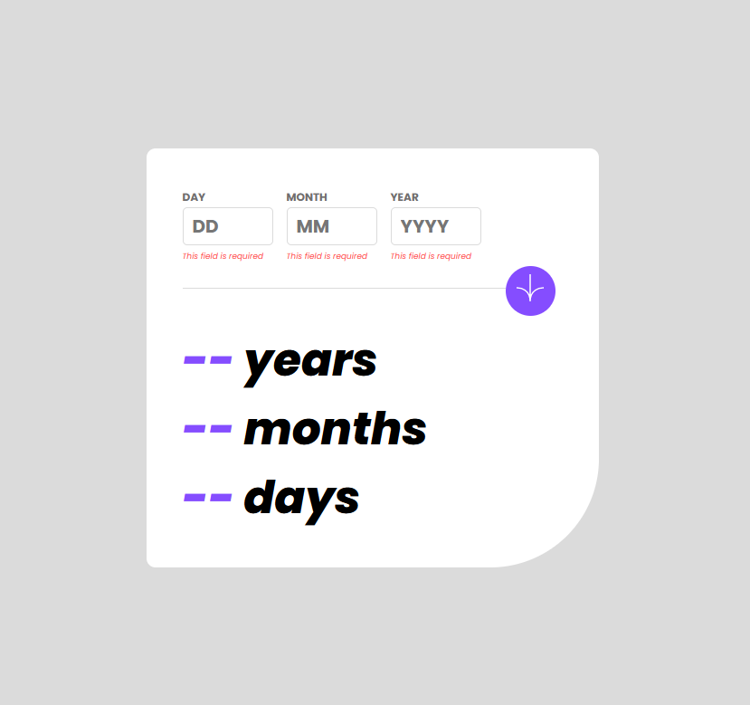

<h1 align = 'center'> Age calculator App </h1>

    

## About the Project

This is a FrontendMentor Project that consist in a age calculator app. The calculator will output how many years the user have, months and days.
The project also has some simple validations, like when the input is empty and others.
The project is also responsive for the most of the devices.

 

<h3 align = 'center'><a href = '#'>See the project</a></h3>

 

## Technologies

- HTML
- SASS
- JavaScript
- Git

 

## Creator

| Author                                                                                                                                      |
| ------------------------------------------------------------------------------------------------------------------------------------------- |
| <a target="_blank" href="https://github.com/JhowBRCG"> </a> |
| &nbsp; &nbsp; &nbsp; Jhonathan                                                                                                              |
